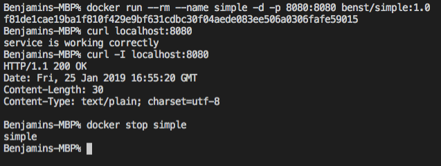

# simple

the sole purpose of this repo is a demo/example golang webserver running inside a docker container.  
It will return *service is working correctly* and a http statuscode of *200* as long everything works.

run it:  
`docker run --rm --name simple -d -p 8080:8080 benst/simple:1.0`

test it:  
`curl localhost:8080` or   
`curl -I localhost:8080`

stop it:  
`docker stop simple`

as shown in the picture:

